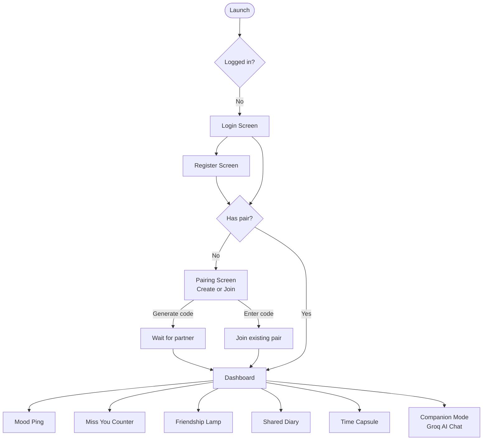
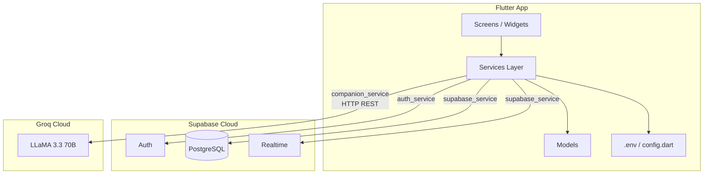

<div align="center">

#  Tiamo

> *"Ti amo" — Italian for "I love you"*

**A Flutter mobile app for long-distance couples to stay emotionally connected — not a chat app, but a presence app.**

[](https://flutter.dev)
[](https://supabase.com)
[](https://groq.com)
[](LICENSE)

</div>

---

##  Project Description

Tiamo is a Flutter-based mobile application designed for long-distance couples and close friends. Unlike traditional messaging apps, Tiamo focuses on **emotional presence** — letting partners share moods, signal availability through a virtual friendship lamp, co-author a shared diary, and leave time-locked messages. An AI-powered Companion Mode (Groq LLaMA 3.3) keeps you company when your partner is away, responding in a casual, human-like texting style.

---

##  Features

| # | Feature | Description |
|---|---------|-------------|
| 1 |  **Authentication** | Email sign-up & sign-in with persistent sessions via Supabase Auth |
| 2 |  **Pairing System** | Connect two users with a unique invite code; real-time auto-redirect on join |
| 3 |  **Mood Ping** | Share your current mood with your partner instantly |
| 4 |  **Miss You Counter** | Tap a button to silently tell your partner you're thinking of them |
| 5 |  **Friendship Lamp** | Pick a color to signal your emotional presence across distance |
| 6 |  **Shared Diary** | Write diary entries that only your paired partner can read |
| 7 |  **Time Capsule** | Leave a message that unlocks only on a chosen future date |
| 8 |  **AI Companion Mode** | Groq-powered LLaMA 3.3 AI that chats casually while your partner is away |

---

##  Tech Stack & Dependencies

### Framework
- **Flutter** `^3.11.0` — cross-platform mobile (Android & iOS)
- **Dart** `^3.11.0`

### Backend & Database
- **Supabase** `^2.8.4` — PostgreSQL database, Auth, Realtime subscriptions

### AI
- **Groq API** (via `http ^1.2.0`) — LLaMA 3.3 70B Versatile model for Companion Mode

### UI
- **Google Fonts** `^6.2.1` — Poppins typography
- **Material 3** with pink-purple gradient theme

### Utilities
- **flutter_dotenv** `^5.2.1` — environment variable management
- **uuid** `^4.5.1` — unique ID generation
- **intl** `^0.20.2` — date/time formatting

---

##  Project Structure

```
tiamo/
 lib/
    main.dart                    # App entry point, Supabase + dotenv init
    config.dart                  # Env variable getters (gitignored)
    config.example.dart          # Template for config setup
    models/                      # Data models
       diary_entry.dart
       pair_model.dart
       time_capsule.dart
       user_profile.dart
    screens/                     # UI screens
       login_screen.dart
       register_screen.dart
       pairing_screen.dart
       dashboard_screen.dart
       shared_diary_screen.dart
       time_capsule_screen.dart
       companion_chat_screen.dart
    services/                    # Business logic & API calls
       auth_service.dart
       supabase_service.dart
       companion_service.dart   # Groq AI integration
    widgets/                     # Reusable UI components
        friendship_lamp_widget.dart
        miss_you_widget.dart
        mood_ping_widget.dart
 assets/                          # Images, fonts, .env
 docs/                            # Architecture & flow diagrams
 android/                         # Android native config
 ios/                             # iOS native config
 .env.example                     # Environment variable template
 pubspec.yaml
 supabase_schema.sql
```

---

##  App Flow Diagram



---

##  Architecture Diagram



---

##  Screenshots

> Add screenshots to `assets/screenshots/` and update the links below.

| Login | Dashboard | Companion Mode |
|-------|-----------|----------------|
|  |  |  |

| Pairing | Shared Diary | Time Capsule |
|---------|-------------|--------------|
|  |  |  |

---

##  Demo Video

> **[ Watch Demo Video](https://youtu.be/YOUR_DEMO_LINK)**
>
> *(Replace with your actual demo video link — max 3 minutes, showing all features)*

---

##  APK Download

> **[ Download latest APK](https://github.com/thanushreesuresh/teamo/releases/latest)**
>
> *(Or build from source — see instructions below)*

---

##  Build & Installation

### Prerequisites
- Flutter SDK `^3.11.0` — [Install Flutter](https://docs.flutter.dev/get-started/install)
- Android Studio + Android SDK (API 21+)
- A [Supabase](https://supabase.com) project
- A [Groq](https://console.groq.com) API key (free)

### 1. Clone the repo
```bash
git clone https://github.com/thanushreesuresh/teamo.git
cd teamo
```

### 2. Set up environment variables
```bash
cp .env.example .env
```
Edit `.env` and fill in your credentials:
```
SUPABASE_URL=https://your-project.supabase.co
SUPABASE_ANON_KEY=your_anon_key
GROQ_API_KEY=your_groq_api_key
```

### 3. Run the database schema
In Supabase Dashboard  SQL Editor, paste and run `supabase_schema.sql`.

### 4. Disable email confirmation *(for dev)*
Supabase Dashboard  Authentication  Providers  Email  turn **OFF** "Confirm email".

### 5. Install dependencies & run
```bash
flutter pub get
flutter run
```

### 6. Build a release APK
```bash
flutter build apk --release
# Output: build/app/outputs/flutter-apk/app-release.apk
```

---

##  Installation Guide (Sideloading APK)

1. On your Android device, go to **Settings  Security**
2. Enable **"Install unknown apps"** (or "Unknown sources")
3. Transfer `app-release.apk` to your device (USB, Google Drive, etc.)
4. Open the APK file on your device and tap **Install**
5. Launch **Tiamo** from your app drawer

---

##  Database Schema

| Table | Description |
|-------|-------------|
| `profiles` | User profile linked to `auth.users` |
| `pairs` | Two users connected by an invite code |
| `diary_entries` | Shared diary entries per pair |
| `time_capsules` | Time-locked messages per pair |

---

##  Team Members

| Name | Role |
|------|------|
| Thanushree Suresh | Flutter Developer, UI/UX, AI Integration |

---

##  AI Tools Used

This project was developed with assistance from:
- **GitHub Copilot** (Claude Sonnet 4.6) — code generation, debugging, UI implementation, Groq/Supabase integration

---

##  License

This project is licensed under the **MIT License** — see the [LICENSE](LICENSE) file for details.
